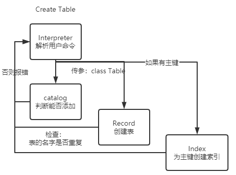
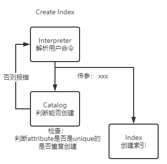
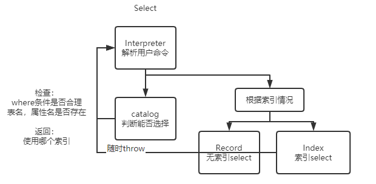

**负责模块：Interpreter, 前端，整合调用**

[TOC]


## Interpreter

Interpreter模块主要负责解析用户传入的命令，并调用对应的接口，首先我们列出需要实现的指令

+ Create 
  + `create table tablename(i int, f float, c char(10) not null unique, primary key(i))`
  + `create index indexname on tablename(attributename)`
+ Insert
  + `insert into table values(...)`
+ Select
  + `select * from table where cond1 and cond2`
  + 这里仅支持单表查询，可以使用and连接各条件如`a < 10 and a > 1 and a <> 6`  
+ delete
  + `delete from table where cond1 and cond2`
+ drop
  + `drop table tablename`
  + `drop index indexname`
+ show
  + `show table tablename`
  + `show index indexname`
  + `show database`

我们采取与上述分割方式相同的多级译码，首先判断指令的种类，如`create table`，`delete`，然后将参数传入对应的函数进行调用。

我们将所有的功能写在`Class Interpreter`类中，类变量包含了`RecordManager, CatalogManager, IndexManager, BufferManager`的实例, 一切都通过`Interpreter`调用，相当于集成了API的功能。

```cpp
class Interpreter
{
public:
    RecordManager Record; // RecordManager, IndexManager和BufferManager在其中调用
    CatalogManager Cata; // Catalog Manager
    Interpreter(); //构造函数
    ~Interpreter(); //析构函数
    void Parse(string sql);            // 解析单条sql的函数
    void CreateTable(std::string str); // 针对create table 场景的函数
    void CreateIndex(string str);      // 针对create index 场景的函数
    void Insert(string str);           // 针对insert 场景的函数
    void Select(string str);           // 针对select 场景的函数
    void Delete(string str);           // Delete from table where 
    void DropTable(std::string str);   // Drop table tablename
    void DropIndex(std::string str);   // Drop index index name
    void ShowTable(std::string str);   // Show table tablename
    void ShowIndex(std::string str);   // show index index name
    void ShowDatabase(std::string str);// show database
};
```

整体的逻辑可以参见下面的流程图：


### Sql Error

数据库运行的过程中可能会随时抛出错误，可能是用户输入的语法错误，也有可能是数据库查询结果错误，也有可能是数据库本身运行出了错误，因此我们需要定义相应的错误类型并在运行过程中使用`try catch`处理错误

所有的sql error都被定义在SqlError.h文件中，只需要一个string记录错误信息即可，因此我们使用`SqlError`基类，其余的错误类型继承自该类即可

```cpp
// Sql运行过程中的报错
class SqlError{
public:
    string msg;
    SqlError(string msg);
};

// 语法错误子类
class SyntaxError: public SqlError{
public:
    SyntaxError(string msg);
};

// 数据库返回错误
class DBError: public SqlError{
public:
    DBError(string msg);
};

// 内部程序运行错误
class InternalError: public SqlError{
public:
    InternalError(string msg);
};
```


### Basic Operations

这里首先列出一些解析过程中大量使用的基本操作的函数

#### Strip

为了实现连续空格的适配，我们实现`strip`函数去除字符串两端的多余空格，类似的，我们也可以实现`lstrip`,`rstrip`,仅去除左端和右端的空格，在特殊场景下加快运行速度

```cpp
string strip(string& s){
    if (s.empty()){
        return s;
    }
    s.erase(0, s.find_first_not_of(" "));
    s.erase(s.find_last_not_of(" ") + 1);
    return s;
}
```


#### split

在Interpreter中划分参数的重要参数是根据某个特殊的字段将字符串分割到vector中，例如将`"a = 1 and b = 2 and c = 3"`通过`"and"`分割为`["a = 1", "b = 2", "c = 3"]`. 通过`string`的`find`方法，我们实现了`split`函数

```cpp
// Name: split
// Function: like split in Python, split string into vector with seperator = flag
// Example: split "abc and def and hij" by "and" into ["abc", "def", "hij"]
// Input:
//      string& str: string to be split
//      vector<string>& sv: vector to put string after split
//      string flag: string to split
// output: void
// Decription: 
//      Implement by string.find
void split_string(string& str, vector<string> &sv, string& flag){
    sv.clear();
    int pos;
    str += flag;//扩展字符串以方便操作
    int size = str.size();
    for (int i = 0; i < size; )
    {
        pos = str.find(flag, i);
        if (pos < size)
        {
            std::string s = str.substr(i, pos - i);
            sv.push_back(s);
            i = pos + flag.size() ;
        }
    }
    return;
}
```

#### get token

解析命令时我们也经常需要从待解释的字符串中提取出一个token，如从`select *from table`中先提取出`select`，然后调用对应的函数，通过`string.find`我们不难实现这一函数

```cpp
// Name: get_token
// Function: get one token from string and erase token from string
// Example: token got from "aaa bbb ccc" is "aaa", and string will be erase to "bbb ccc"
// Input:
//      string &s: string input
// output: 
//      token string
// Decription: 
//      Implement by string.find
string get_token(string &s){
    s = lstrip(s);
    int pos = s.find_first_of(' ');
    string token = s.substr(0, pos);
    // transform(token.begin(), token.end(), token.begin(), ::toupper);
    s = s.erase(0, pos);
    return token;
}
```

#### icasecompare

我们的数据库设计了大小写容错设计，这需要我们实现忽略大小写的判断，藉由`std::equal`加匿名函数里使用`tolower`统一到小写判断，我们可以实现这一功能：

```cpp
// Name: icasecompare
// Function: compare two string equal or not ignoring case difference
// Example: icasecompare("abc", "ABC") returns true
// Input:
//      string &a: string 1 to be compared
//      string &b: string 2 to be compared
// output: 
//      bool: equal or not
bool icasecompare(const string& a, const string& b)
{
		if (a.length() == b.length()) {
		    return std::equal(a.begin(), a.end(), b.begin(),
		                      [](char a, char b) {
		                          return tolower(a) == tolower(b);
		                      });
        }
        return false;
}
```

#### Parse Data Type

我们的数据库支持`int, float, char(n)`三种数据类型，因此我们同样需要对传入的文本进行分类，如`1, 1.5, "char"`分别属于`int, float, char(n)`三类，我们将此功能封装为`ParseDataType`函数

```cpp
/*
@brief 根据字符串str解析数据类型，非法则标记为int，（后续我们会对Int做额外的容错处理）
@param str 待解析的字符串
@return 解析出的DataType类型变量
*/
DataType ParseDataType(string& str){
    DataType data_type;
    if( str[0] == '\"' && str[str.length() - 1] == '\"' ){
        str = str.substr(1, str.length() - 2);
        data_type = CHAR_UNIT;
    }else if( str.find(".") != string::npos ){
        data_type = FLOAT_UNIT;
        // float_value = stol(str);
    }else{
        data_type = INT_UNIT;
    }
    return data_type;
}
```


#### Parse String Type

根据解析出的Type和字符串本身，我们可以将其放到我们的`union Value`数据类型中

```cpp
/*
@brief 根据字符串str，和对应的type 解析出union value数据, 这里对int做容错处理，无法解析时throw SyntaxError
@param str 待解析的字符串
@param type str经由 ParseDataType(str)得到的类型
@return 解析出的union Value类型
*/
Value ParseStringType(DataType type, string& str){
    Value value;
    switch(type){
        case INT_UNIT:
            try{
                value.int_value = stoi(str);
            }catch(...){
                SyntaxError e("Wrong condition value syntax in " + str);
                throw e;
            }
            break;
        case FLOAT_UNIT:
            value.float_value = stof(str);
            break;
        case CHAR_UNIT:
            char* str_c = (char *)malloc(sizeof(char) * (str.length() + 1) );
            strcpy(str_c, str.c_str());
            value.char_n_value = str_c; 
            break;
    }
    return value;
}
```


### Interpreter类的实现

接下来我们逐命令解释Interpreter类的实现。

由于用户输入命令的解析，去连续空格，大小写匹配较容易理解但代码判断较多，我们仅从逻辑与流程上解释，具体的实现可以参考我们的代码。

#### Create命令



具体的流程见上图

+ Interpreter解析出用户创建的表名
+ Catalog进行一系列判断，之后创建相应的表
+ 如果有主键，还需要为主键创建索引，创建索引的流程如下





#### Select



select命令被分为三个部分

+ attribute array: 为选择的列
+ from table: 来自表的数据（暂时只支持单表查询）
+ condition array