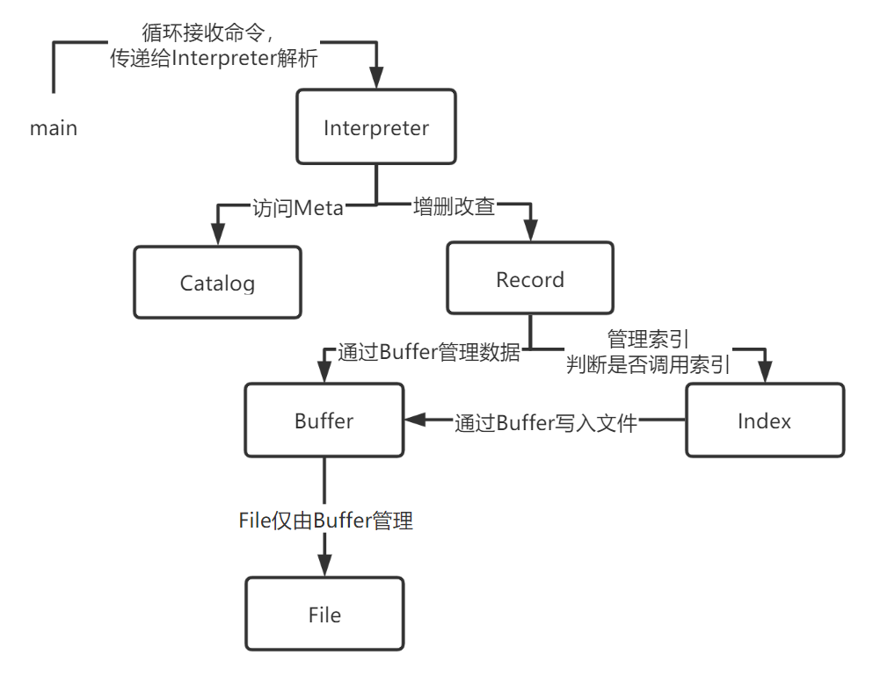

**Minisql 实验报告**

**3180105843 汪奕晨**

全体组员：汪奕晨，罗志凡，张效源，章茹，陈信宇

[TOC]

## My work

首先介绍本人在本次项目设计中负责的工作，主要分是

+ 相关数据结构的设计
+ Interpreter模块的编写
+ 理清Catalog, Record, Index, Buffer的逻辑并进行正确调用（API的功能）
+ 项目整体的整合，测试与展示
+ vue + flask前端编写


### 相关数据结构的设计

`Minisql.h`记录了核心的类，如保存属性的类，保存表的类，表Meta信息的类，索引的类……

我主要设计的数据结构如下：

#### Attribute类

Attribute类需要存储表的属性信息，会以vector形式存在对应的表中，因此不需要存储表名信息，需要存储

+ 成员
  + 属性名称
  + 属性类型
  + Not NULL, Unique, Primary key等标记
+ 函数
  + 初始化构造函数（接收相关参数）
  + 主键设置函数
  + Print输出信息函数

类实现的声明如下，具体的实现不在此处展示(具体的可以参考附录代码)

```cpp
// 记录属性的类
class Attribute
{
public:				  //直接都Public算了吧
	string name;	  //属性名
	int type;		  //属性的类型，实际上是DataType, 记成int保留可扩展性
	int charlen;	  //如果是char类型，保存其最大长度 char(n)
	bool notnull;	  //not null标记
	bool unique;	  //unique 标记
	bool primary_key; // primary key 标记
public:
	// name: Attribute constructor
	// Function: init value in class
	Attribute(string name, string typestr, bool notnull = false, bool unique = false, bool primary_key = false);
	Attribute();
	// name:set_pk
	// Function: set primary key of attribute, becase "primary key(pk)" usually occurs in the end
	void set_pk(bool pk);
	// name: print
	// Function: Print Attribute info
	void Print();
};
```

值得一提的是构造函数，在Attribute外侧判断类型后输入较为复杂，这里直接输入`type string`进入构造函数，在构造函数内判断。合法的`type string`有三类

1. `int`
2. `float`
3. `char(n)`, 其中`n`是数字

这里我们使用C++的正则库进行匹配，`char(n)`中的数字也可以通过正则提取。当匹配失败时扔出`Syntax Error`（具体的Error在下一节Sql Error中会介绍），由`Interpreter`调用时`Catch`即可。


此外，我为每个类编写了`Print`函数方便打印调试信息。


### Sql Error

数据库运行的过程中可能会随时抛出错误，可能是用户输入的语法错误，也有可能是数据库查询结果错误，也有可能是数据库本身运行出了错误，因此我们需要定义相应的错误类型并在运行过程中使用`try catch`处理错误

所有的sql error都被定义在SqlError.h文件中，只需要一个string记录错误信息即可，因此我们使用`SqlError`基类，其余的错误类型继承自该类即可

```cpp
// Sql运行过程中的报错
class SqlError{
public:
    string msg;
    SqlError(string msg);
};

// 语法错误类，用户输入有误
class SyntaxError: public SqlError{
public:
    SyntaxError(string msg);
};

// 数据库返回错误，用户输入语法无错，但是与数据库不匹配
class DBError: public SqlError{
public:
    DBError(string msg);
};

// 内部程序运行错误，出现此错误说明数据库内部出现了某些错误
class InternalError: public SqlError{
public:
    InternalError(string msg);
};
```


### Basic Operations

这里首先列出一些Interpreter解析过程中大量使用的基本操作的函数，主要为一些字符串处理函数。

#### Strip

为了实现连续空格的适配，我们实现`strip`函数去除字符串两端的多余空格，类似的，我们也可以实现`lstrip`,`rstrip`,仅去除左端和右端的空格，在特殊场景下加快运行速度

```cpp
string strip(string& s){
    if (s.empty()){
        return s;
    }
    s.erase(0, s.find_first_not_of(" "));
    s.erase(s.find_last_not_of(" ") + 1);
    return s;
}
```


#### split

在Interpreter中划分参数的重要参数是根据某个特殊的字段将字符串分割到vector中，例如将`"a = 1 and b = 2 and c = 3"`通过`"and"`分割为`["a = 1", "b = 2", "c = 3"]`. 通过`string`的`find`方法，我们实现了`split`函数

```cpp
// Name: split
// Function: like split in Python, split string into vector with seperator = flag
// Example: split "abc and def and hij" by "and" into ["abc", "def", "hij"]
// Input:
//      string& str: string to be split
//      vector<string>& sv: vector to put string after split
//      string flag: string to split
// output: void
// Decription: 
//      Implement by string.find
void split_string(string& str, vector<string> &sv, string& flag){
    sv.clear();
    int pos;
    str += flag;//扩展字符串以方便操作
    int size = str.size();
    for (int i = 0; i < size; )
    {
        pos = str.find(flag, i);
        if (pos < size)
        {
            std::string s = str.substr(i, pos - i);
            sv.push_back(s);
            i = pos + flag.size() ;
        }
    }
    return;
}
```

#### get token

解析命令时我们也经常需要从待解释的字符串中提取出一个token，如从`select *from table`中先提取出`select`，然后调用对应的函数，通过`string.find`我们不难实现这一函数

```cpp
// Name: get_token
// Function: get one token from string and erase token from string
// Example: token got from "aaa bbb ccc" is "aaa", and string will be erase to "bbb ccc"
// Input:
//      string &s: string input
// output: 
//      token string
// Decription: 
//      Implement by string.find
string get_token(string &s){
    s = lstrip(s);
    int pos = s.find_first_of(' ');
    string token = s.substr(0, pos);
    // transform(token.begin(), token.end(), token.begin(), ::toupper);
    s = s.erase(0, pos);
    return token;
}
```

#### icasecompare

我们的数据库设计了大小写容错设计，这需要我们实现忽略大小写的判断，藉由`std::equal`加匿名函数里使用`tolower`统一到小写判断，我们可以实现这一功能：

```cpp
// Name: icasecompare
// Function: compare two string equal or not ignoring case difference
// Example: icasecompare("abc", "ABC") returns true
// Input:
//      string &a: string 1 to be compared
//      string &b: string 2 to be compared
// output: 
//      bool: equal or not
bool icasecompare(const string& a, const string& b)
{
		if (a.length() == b.length()) {
		    return std::equal(a.begin(), a.end(), b.begin(),
		                      [](char a, char b) {
		                          return tolower(a) == tolower(b);
		                      });
        }
        return false;
}
```

#### Parse Data Type

我们的数据库支持`int, float, char(n)`三种数据类型，因此我们同样需要对传入的文本进行分类，如`1, 1.5, "char"`分别属于`int, float, char(n)`三类，我们将此功能封装为`ParseDataType`函数

```cpp
/*
@brief 根据字符串str解析数据类型，非法则标记为int，（后续我们会对Int做额外的容错处理）
@param str 待解析的字符串
@return 解析出的DataType类型变量
*/
DataType ParseDataType(string& str){
    DataType data_type;
    if( str[0] == '\"' && str[str.length() - 1] == '\"' ){
        str = str.substr(1, str.length() - 2);
        data_type = CHAR_UNIT;
    }else if( str.find(".") != string::npos ){
        data_type = FLOAT_UNIT;
        // float_value = stol(str);
    }else{
        data_type = INT_UNIT;
    }
    return data_type;
}
```


#### Parse String Type

根据解析出的Type和字符串本身，我们可以将其放到我们的`union Value`数据类型中

```cpp
/*
@brief 根据字符串str，和对应的type 解析出union value数据, 这里对int做容错处理，无法解析时throw SyntaxError
@param str 待解析的字符串
@param type str经由 ParseDataType(str)得到的类型
@return 解析出的union Value类型
*/
Value ParseStringType(DataType type, string& str){
    Value value;
    switch(type){
        case INT_UNIT:
            try{
                value.int_value = stoi(str);
            }catch(...){
                SyntaxError e("Wrong condition value syntax in " + str);
                throw e;
            }
            break;
        case FLOAT_UNIT:
            value.float_value = stof(str);
            break;
        case CHAR_UNIT:
            char* str_c = (char *)malloc(sizeof(char) * (str.length() + 1) );
            strcpy(str_c, str.c_str());
            value.char_n_value = str_c; 
            break;
    }
    return value;
}
```


### Interpreter类的实现

Interpreter模块主要负责解析用户传入的命令，并调用对应的接口，首先我们列出需要实现的指令

+ Create 
  + `create table tablename(i int, f float, c char(10) not null unique, primary key(i))`
  + `create index indexname on tablename(attributename)`
+ Insert
  + `insert into table values(...)`
+ Select
  + `select * from table where cond1 and cond2`
  + 这里仅支持单表查询，可以使用and连接各条件如`a < 10 and a > 1 and a <> 6`  
+ delete
  + `delete from table where cond1 and cond2`
+ drop
  + `drop table tablename`
  + `drop index indexname`
+ show
  + `show table tablename`
  + `show index indexname`
  + `show database`

我们采取与上述分割方式相同的多级译码，首先判断指令的种类，如`create table`，`delete`，然后将参数传入对应的函数进行调用。

我们将所有的功能写在`Class Interpreter`类中，类变量包含了`RecordManager, CatalogManager, IndexManager, BufferManager`的实例, 一切都通过`Interpreter`调用，相当于集成了API的功能。

```cpp
class Interpreter
{
public:
    RecordManager Record; // RecordManager, IndexManager和BufferManager在其中调用
    CatalogManager Cata; // Catalog Manager
    Interpreter(); //构造函数
    ~Interpreter(); //析构函数
    void Parse(string sql);            // 解析单条sql的函数
    void CreateTable(std::string str); // 针对create table 场景的函数
    void CreateIndex(string str);      // 针对create index 场景的函数
    void Insert(string str);           // 针对insert 场景的函数
    void Select(string str);           // 针对select 场景的函数
    void Delete(string str);           // Delete from table where 
    void DropTable(std::string str);   // Drop table tablename
    void DropIndex(std::string str);   // Drop index index name
    void ShowTable(std::string str);   // Show table tablename
    void ShowIndex(std::string str);   // show index index name
    void ShowDatabase(std::string str);// show database
};
```


接下来我们逐命令解释Interpreter类的实现。

由于用户输入命令的解析，去连续空格，大小写匹配较容易理解但代码判断较多，我们仅从逻辑与流程上解释，具体的实现可以参考我们的代码。

#### Create命令


具体的流程见上图

+ Interpreter解析出用户创建的表名
+ Catalog进行一系列判断，之后创建相应的表
+ 如果有主键，还需要为主键创建索引，创建索引的流程如下
  + 这一层创建索引的逻辑由Interpreter判断后调用Catalog和Record不同接口实现


#### Select


select命令被分为三个部分

+ attribute array: 为选择的列
+ from table: 来自表的数据（暂时只支持单表查询）
+ condition array

对单个等值条件select时，如果该属性上有索引存在，则通过索引查询。


#### Insert and Delete

Insert 和 Delete 时需要考虑表上是否存在索引，如果存在索引，则需要在对应的索引里也进行添加或删除。

在Insert前我们需要执行一系列逻辑判断，如

+ Insert表名是否正确
+ Insert的value和对应的属性类型是否匹配

考虑到int可以隐式地转换为float，我们在做测试时也可以进行隐形的转换，使得我们的数据库容纳更多的功能。（即，我们可以直接为float类型属性插入`2`而不用非是`2.0`


Delete时的选择判断和Select处属于同一逻辑，这里不再赘述。


关于有索引，无索引情况的区分，我们在设计`Table`数据结构时，`Table`内存储了指向所有该表上的`Index`指针列表，Interpreter只需要调用RecordManager, RecordManager会自动判断，这对Interpreter来说是hidden的。


#### Show

为了方便用户获取数据库信息，我们为minisql实现了下列`show`命令用于输出相关的表信息

+ `show database`: 打印数据库的所有表信息和所有的索引信息
+ `show table $tablename`: 打印表的信息，包括表名，属性信息，索引信息
+ `show index $indexname`：打印索引的信息，即索引名、依赖的表和依赖的表上属性名

三个`show`命令均是通过调用Catalog Manager得到数据库的meta信息，处理后输出给用户。


#### 结果展示

+ create 不含index的表
+ create 含primary key的表，会自动为primary key创建主键
+ create 含两个unique属性的表，会自动为unique属性创建索引


+ show table 命令返回表信息
+ insert值并通过select * 查询判断是否正确插入


+ select 对`int`属性含等值判断 `=`
+ select 对`int`属性含不等值判断`<>`
+ select 对`char(n)`属性含小于等于判断`<=`
+ select 对`float`属性含大于判断`>`
+ select 使用`and`连接的复杂条件选择


+ delete 使用条件筛选（这里支持的条件与select相同）
+ 使用select观察是否成功


**索引有效性的测试：**

使用下列脚本为speedtest4表插入10000条数据

```cpp
>> drop table speedtest;
>> create table speedtest4(i int unique, j int);
```

```cpp
int i;
string str;
Interpreter I;
for( i = 10; i < 10010; i++){
    str = "insert into speedtest4 values( " + to_string(i) + " , " + to_string(i) + "\")";
    if( i == 10){
        cout<<str<<endl;
    }
    I.Parse(str);
    printf("\r%d", i);
}
```

其中属性`i`上有索引，属性`j`上没有索引，分别做等值查询，观察select需要的时间


发现使用索引大约需要`1e-3`秒，不使用索引则需要大约`4e-3`秒，这说明我们的索引确实对查询做了优化，由于本身我们的逻辑由c/c++写成，运行速度较快，故10000条数据才会有较大的差别。


### 容错性测试

当我们的数据库交付用户使用时，与用户交互的过程中无法避免用户产生的失误，因此我们需要进行一些字符串的宽容处理，如忽略用户输入连续的空格，当用户输入错误的信息时能够判断并报错，不至于让数据库出错崩溃。实现的主要思路是通过Catalog先进行较为完善的测试，将错误信息返回给用户。如果是只有Record能返回的错误，如重复值的插入，则通过`throw...catch...`的方式由Interpreter处理并告知用户，使得整个程序在无论什么情况下都能良好地运行。

#### 连续空格处理

连续空格是较为常见的一种形式，不同用户输入空格的习惯不同。实现的方式是在先前Basic Opeartion中提到的字符串处理，如`strip, lstrip, rstrip`处理空格。这里仅做效果的检验与展示


#### Show命令的容错

+ `show`后参数错误
+ `show table`后表名不存在
+ `show index`后index名不存在


#### Create

+ Create table 错误
  + `create`后参数错误
  + `create`表名已经存在
  + `create`创建的属性名重复
  + `create`创建的属性主键重复
  + `create`创建的属性类型错误 


+ create index错误
  + index参数错误
  + index创建在了非unique属性上
  + index名已经存在
  + index依赖的表不存在
  + index依赖的属性不存在


#### Insert 错误

+ Insert 语法错误
+ Insert的表不存在
+ Insert value数目错误
+ Insert value 类型错误
+ Insert 在unique属性上产生了重复值


正如先前所说，我们可以隐式地将`int`转化为`float`，因此在需要`float`处提供`int`类型数据也是可以正确运行的。


#### Select 错误

+ Select属性不存在
+ select where条件中属性不存在
+ Select表不存在
+ select where 条件中值类型错误


#### delete错误

delete错误几乎与select重合，判断条件错误会和select一样处理

+ delete 语法错误
+ delete 表名不存在
+ delete 条件属性错误
+ delete 条件值类型错误

这里不作重复的展示


#### drop错误

+ drop语法错误
+ drop对象表不存在
+ drop对象index不存在


### 图形化GUI界面

为了给用户提供更好的体验，我们使用vue + flask实现了图形化界面，界面如下


实现方式是通过flask后端以脚本形式访问数据库，输出相关的结果，vue中接收用户输出并请求后端API后返回脚本返回结果。在前端我们其实可以通过控制台返回的字符使用JavaScript处理后输出结果，如对select结果处理成table，以更加直观的方式返回给用户，但受限于时间限制，本次只是暂时返回console的结果。

下面展示部分结果，由于与console的命令输出完全一致，这里不做过多的展示


## 整体Minisql流程

在本人负责的部分以外，这里介绍整体项目以让大家对项目的实现逻辑有更整体的印象

不同于提供文档中要求的架构，我们采用了自己的特殊架构



我们的架构以Record Manager为核心建立，所有数据库的数据增删改查操作都通过Record完成，同时根据索引情况调用Index Manager。Buffer是Record和Index和文件之间操作的唯一方式，也方便我们对文件的同一管理。

Interpreter继承了API的功能，负责通过用户输入的字符串构造具体的数据类型并调用相应的接口。在先前本人实现的文档中已经解释的较为清楚。

Catalog Manager在这个过程中通过对表Meta的管理，可以在让我们的数据进入Reocrd前就通过Meta检测出大部分的错误，如数据类型不一致，属性名不存在等。同时Catalog也可以返回用户查询的表信息，索引信息，方便用户观察数据库信息。

Catalog Manager保证我们的数据结构以正确的形式进入Record Manager，Record实现对数据的增删改查，同时经过Buffer写回文件保存。同时当索引存在时，也会调用Index Manager对索引进行维护。

Index Manager提供对特定表特定属性的B+树索引，也通过统一的Buffer写回文件维护。

Buffer为我们设计的难点之一，提供将文件数据读入内存的缓存Block，修改时支持WriteBack策略，集中在内存里修改，不必高频的修改文件，提高了运行速度。且在析构时对Block的valid和dirty进行判断，将脏块自动写回文件，保证了数据的一致性。


## 附录

本人实现的代码的拷贝

#### Attribute类的声明与定义(声明见文档中)

```cpp

Attribute::Attribute() {}

Attribute::Attribute(string name, string typestr, bool notnull, bool unique,
                     bool primary_key) {
    std::regex re_char("char\\(\\d+\\)", regex_constants::icase);
    std::regex re_int("int", regex_constants::icase);
    std::regex re_float("float", regex_constants::icase);
    std::regex re_num("\\d+", regex_constants::icase);
    this->charlen = -1;
    if (std::regex_match(typestr, re_int)) {
        this->type = INT_UNIT;
    } else if (std::regex_match(typestr, re_float)) {
        this->type = FLOAT_UNIT;
    } else if (std::regex_match(typestr, re_char)) {
        this->type = CHAR_UNIT;
        sregex_iterator itr1(typestr.begin(), typestr.end(), re_num);
        sregex_iterator itr2;
        for (sregex_iterator itr = itr1; itr != itr2; ++itr) {
            // ！！！ 这里可能有点隐患，默认\d+是贪婪匹配了
            // string L = itr->str();
            // cout<<L<<"\n";
            this->charlen = stoi(itr->str());
            break;
            // cout << itr->str() << "\n";
        }
    } else {
        SyntaxError e("Invalid type \"" + typestr + "\"");
        throw e;
    }
    this->name = name;
    this->charlen = charlen;
    this->notnull = notnull;
    this->unique = unique;
    this->primary_key = primary_key;
    // cout<<"[info]: Create Attribute "<<(this->name)<<", type =
    // "<<this->type<<", charlen = "<<this->charlen<<"\n"; cout<<"[debug]:
    // "<<this->name.length()<<"\n";
}

void Attribute::set_pk(bool pk) {
    // cout << "[debug]: call set pk for " << this->name << " to pk=" << pk <<
    // "\n";
    this->primary_key = pk;
}

void Attribute::Print() {
    // cout<<"[debug]: "<<this->name.length()<<"\n";
    cout << "[Attribute info]: Attr:" << this->name << ", type:";
    if (this->type == INT_UNIT) {
        cout << "int";
    } else if (this->type == FLOAT_UNIT) {
        cout << "float";
    } else if (this->type == CHAR_UNIT) {
        cout << "char(" << this->charlen << ")";
    } else {
        cout << "Invalid";
    }
    if (this->notnull) {
        cout << ", not null";
    }
    if (this->unique) {
        cout << ", unique";
    }
    if (this->primary_key) {
        cout << ", primary key";
    }

    cout << "\n";
}
```


#### Interpreter类的声明与实现

```cpp
#ifndef _INTERPRETER_H_
#define _INTERPRETER_H_
#include <string>
#include "CatalogManager.h"
#include "RecordManager.h"
using namespace std;
// sql解释器
class Interpreter
{
public:
    RecordManager Record; // RecordManager, IndexManager和BufferManager在其中调用
    CatalogManager Cata; // Catalog Manager
    Interpreter(); //构造函数
    ~Interpreter(); //析构函数
    void Parse(string sql);            // 解析单条sql的函数
    void CreateTable(std::string str); // 针对create table 场景的函数
    void CreateIndex(string str);      // 针对create index 场景的函数
    void Insert(string str);           // 针对insert 场景的函数
    void Select(string str);           // 针对select 场景的函数
    void Delete(string str);           // Delete from table where 
    void DropTable(std::string str);   // Drop table tablename
    void DropIndex(std::string str);   // Drop index index name
    void ShowTable(std::string str);   // Show table tablename
    void ShowIndex(std::string str);   // show index index name
    void ShowDatabase(std::string str);// show database
};

#endif
```

```cpp
#include <iostream>
#include <string>
#include <vector>
#include <map>
#include <sstream>
#include <ctime>
#include <algorithm>
#include <regex>
#include <cstring>
#include "Interpreter.h"
#include "Basicop.h"
#include "SqlError.h"
// #include "Attribute.h"
#include "MiniSQL.h"
// #define DEBUG
// DEBUG INFO开关
// #define DEBUG 0
using namespace std;

Interpreter::Interpreter() : Cata(), Record()
{
    vector<Index *> pindex_list = Cata.GetAllIndex();
    vector<Index> index_list;
    for (auto pindex : pindex_list)
    {
        index_list.push_back(*pindex);
        // pindex->Print();
    }
    // cout<<"[Interpreter debug]: begin set index int map"<<"\n";
    Record.imanager->setindexIntMap(index_list);
}

Interpreter::~Interpreter()
{
    // this->Record.~RecordManager();
    // this->Cata.~CatalogManager();
    // delete &Record;
    // delete &Cata;
}

void Interpreter::Parse(string sql)
{
    string t = sql;
    strip(t);
    string token = get_token(t);
    // cout<<"token = "<<token<<"\n";
    try
    {
        if (icasecompare(token, "CREATE"))
        {
            // pos = t.find_first_of(' ');
            // token = t.substr(0, pos);
            // t.erase(0, pos);
            // t = strip(t);
            token = get_token(t);
            if (icasecompare(token, "TABLE"))
            {
                this->CreateTable(t);
            }
            else if (icasecompare(token, "INDEX"))
            {
                this->CreateIndex(t);
            }
            else
            {
                cout << "[Syntax Error]: "
                     << "you can only create table or index"
                     << "\n";
            }
        }
        else if (icasecompare(token, "INSERT"))
        {
            token = get_token(t);
            if (icasecompare(token, "INTO"))
            {
                this->Insert(t);
            }
            else
            {
                cout << "[Syntax Error]: "
                     << "Insert must be followed by \"into\""
                     << "\n";
            }
        }
        else if (icasecompare(token, "SELECT"))
        {
            this->Select(t);
        }
        else if (icasecompare(token, "DROP"))
        {
            token = get_token(t);
            if (icasecompare(token, "TABLE"))
            {
                this->DropTable(t);
            }
            else if (icasecompare(token, "INDEX"))
            {
                this->DropIndex(t);
            }
            else
            {
                cout << "[Syntax Error]: "
                     << "you can only drop table or index"
                     << "\n";
            }
        }
        else if (icasecompare(token, "DELETE"))
        {
            token = get_token(t);
            if (icasecompare(token, "FROM"))
            {
                this->Delete(t);
            }
            else
            {
                cout << "[Syntax Error]: "
                     << "Delete must be followed by \"from\""
                     << "\n";
            }
        }
        else if (icasecompare(token, "SHOW"))
        {
            token = get_token(t);
            if (icasecompare(token, "table"))
            {
                this->ShowTable(t);
            }
            else if (icasecompare(token, "index"))
            {
                this->ShowIndex(t);
            }
            else if (icasecompare(token, "database"))
            {
                this->ShowDatabase(t);
            }
            else
            {
                cout << "[Syntax Error]: "
                     << "Show must be followed by \"table\" or \"index\" or \"database\""
                     << "\n";
            }
        }
        else
        {
            cout << "[Error]: Wrong command can not interpret " << token << "\n";
        }
    }
    catch (SyntaxError e)
    {
        cout << "[Syntax Error]: " << e.msg << "\n";
        // throw e;
    }
    catch (DBError e)
    {
        cout << "[Runtime Error]: " << e.msg << "\n";
        // throw e;
    }
    catch (InternalError e)
    {
        cout << "[Internal Error]: " << e.msg << "\n";
    }
}

void Interpreter::ShowDatabase(std::string str)
{
    strip(str);
    if (!str.empty())
    {
        SyntaxError e("Show database can not be followed by other characters");
        throw e;
    }
    vector<Table *> table_pointer_vec = Cata.GetAllTable();
    vector<Index *> index_pointer_vec = Cata.GetAllIndex();
    cout << "[All Table Info]:"
         << "\n";
    for (auto table : table_pointer_vec)
    {
        table->Print();
    }
    cout << "[All Index Info]:"
         << "\n";
    for (auto index : index_pointer_vec)
    {
        index->Print();
    }
}

void Interpreter::ShowTable(string str)
{
    string &tablename = str;
    strip(tablename);
    Table *table = Cata.GetTableCatalog(tablename);
    if (table == NULL)
    {
        DBError e("Invalid table name " + tablename);
        throw e;
    }
    table->Print();
    for (auto index : table->Index_name)
    {
        index->Print();
    }
}

void Interpreter::ShowIndex(string str)
{
    string &indexname = str;
    strip(indexname);
    Index *index = Cata.GetIndexCatalog(indexname);
    if (index == NULL)
    {
        DBError e("Invalid index name " + indexname);
        throw e;
    }
    index->Print();
}

void Interpreter::Delete(string str)
{
    string tablename = get_token(str);
    string token = get_token(str);
    if (!icasecompare(token, "WHERE"))
    {
        SyntaxError e("Delete table tablename from<<");
        throw e;
    }
    vector<ConditionUnit> cond_vec;
    Table *table = Cata.GetTableCatalog(tablename);
    if (table == NULL)
    {
        DBError e("No such Table " + tablename);
        throw e;
    }
    try
    {
        cond_vec = ParseCondition(str);
    }
    catch (SyntaxError e)
    {
        throw e;
    }

    // debug 信息
    // cout<<"[Interpreter Delete Debug]:"<<"\n";
    // for(auto cond:cond_vec){
    //     cond.Print();
    // }
    // cout<<"[Interpreter Delete Debug End]"<<"\n";

    // 数据存储
    // 表名 tablename
    // 条件 cond_vec
    pair<int, string> response;
    response = Cata.DeleteTest(tablename, cond_vec);
    if (response.first == -2)
    {
        SyntaxError e("Invalid table name " + tablename);
        throw e;
    }
    else if (response.first == -1)
    {
        SyntaxError e("Delete conditions error");
        throw e;
    }
    else if (response.first == 0 || response.first == 1)
    {
        // 使用Record删除 和 索引删除都是这里
        Table *table_pointer = Cata.GetTableCatalog(tablename);
        Record.DeleteTuple(*table_pointer, cond_vec);
        cout << "Delete successfully"
             << "\n";

        // // 索引删除
        // string index_name = response.second;
        // cout << "[Interpreter Delete]: by index " << index_name << "\n";
        // cout << "not supported yet"
        //      << "\n";
    }
    else
    {
        SyntaxError e("Wrong catalog return value " + to_string(response.first));
        throw e;
    }
}

void Interpreter::DropTable(string str)
{
    strip(str);
    if (str.find(" ") != string::npos)
    {
        SyntaxError e("Invalid Table Name in Drop Table");
        throw e;
    }
    // Here Table Name to Drop is 'str'
    // cout<<"[Debug info]: Drop Table Name=\""<<str<<"\""<<"\n";

    // 调用Catalog的部分
    string tablename = str;
    Table *table = Cata.GetTableCatalog(tablename);
    if (table == NULL)
    {
        DBError e("Invalid table name \"" + tablename + "\"");
        throw e;
    }

    Index* index;
    int n = table->Index_name.size();
    for (int i=0; i<n; i++)
    {
        index = table->Index_name[0];
        this->DropIndex(index->index_name);
    }
    // for (auto index : table->Index_name)
    // {
    //     cout << index->index_name;
    //     this->DropIndex(index->index_name);
        // if( !(this->DropIndex(index->index_name)) ){
        //     cout<<"Drop index \"" + index->index_name + "\" of table \"" + tablename + "\" fail"<<"\n";
        // }
    // }

    if (Cata.DropTable(str))
    {
        cout << "Drop Table \"" << str << "\" succussfully"
             << "\n";
    }
    else
    {
        cout << "Drop Table \"" << str << "\" failed"
             << "\n";
    }
    string filename_data = TABLE_PATH + str + TABLE_SUFFIX;
    this->Record.bmanager->FlushBlock(filename_data);
}

void Interpreter::DropIndex(string str)
{
    strip(str);
    if (str.find(" ") != string::npos)
    {
        SyntaxError e("Invalid Table Name in Drop Index");
        throw e;
    }
    // Here Index Name to Drop is 'str'
    // cout<<"[info]: Drop Index Name=\""<<str<<"\""<<"\n";
    Index ind(*Cata.GetIndexCatalog(str));
    bool b = Cata.DropIndex(str);
    if (!b)
    {
        DBError e("Drop index \"" + str + "\" failed");
        throw e;
    }
    cout << "Drop index \"" << str << "\" successfully"
         << "\n";
    string filename_index = INDEX_PATH + str + INDEX_SUFFIX;
    this->Record.imanager->buffer.FlushBlock(filename_index);
    this->Record.imanager->dropIndex(ind);
}

void Interpreter::Select(string str)
{
    /*
        Select a.attr1 b.attr2 from tablea as a, tableb as b where a.xx = b.yy; // not support now;
        Select attrname1, attrname2 from table where cond1 = value1, cond2 = value2;
    */
    string ostr = str;
    int from_pos = str.find("from");
    if (from_pos == string::npos)
    {
        from_pos = str.find("FROM");
    }
    int where_pos = str.find("where");
    if (where_pos == string::npos)
    {
        where_pos = str.find("WHERE");
    }

    if (from_pos == string::npos)
    {
        SyntaxError e("No from in select query\n");
        throw e;
    }

    string attr_str = str.substr(0, from_pos), from_str, where_str;
    if (where_pos != string::npos)
    {
        from_str = str.substr(from_pos + 4, where_pos - from_pos - 5);
        where_str = str.substr(where_pos + 5, str.length() - where_pos - 5);
    }
    else
    {
        from_str = str.substr(from_pos + 4, str.length() - from_pos - 4);
        where_str = "";
    }
    // cout<<"[debug]: \nattr string="<<attr_str<<"\nfrom string="<<from_str<<"\nwhere string="<<where_str<<"\n";
    vector<string> attr_vec;
    vector<string> table_vec;
    vector<string> temp;
    vector<ConditionUnit> cond_vec;
    map<string, string> table_name_map;
    strip(attr_str);
    strip(from_str);
    strip(where_str);

    split(attr_str, attr_vec, ',');

    for (vector<string>::iterator iter = attr_vec.begin(); iter != attr_vec.end(); iter++)
    {
        strip(*iter);
        if ((*iter).find_first_of(" ") != string::npos)
        {
            SyntaxError e("Invalid attribute name\n");
            throw e;
        }
        // int dotpos = (*iter).find_first_of(".");
        // if(dotpos != string::npos){
        // like a.attr
        // }
    }

    split(from_str, temp, ',');
    for (vector<string>::iterator iter = temp.begin(); iter != temp.end(); iter++)
    {
        string table_str = *iter;
        strip(table_str);
        vector<string> infield_vec;
        split(table_str, infield_vec, ' ');
        if (infield_vec.size() == 1)
        {
            table_name_map[infield_vec[0]] = infield_vec[0];
            table_vec.push_back(infield_vec[0]);
        }
        else if (infield_vec.size() == 3 && icasecompare(infield_vec[1], "as"))
        {
            table_name_map[infield_vec[2]] = infield_vec[0];
            table_vec.push_back(infield_vec[0]);
        }
        else
        {
            cout << "[Interpreter debug]: " << infield_vec.size() << "\n";
            SyntaxError e("Invalid table name  \"" + table_str + "\"");
            throw e;
        }
    }

    if (table_vec.size() < 1)
    {
        SyntaxError e("No table is selected\n");
        throw e;
    }
    // 暂时不支持多表查询
    if (table_vec.size() > 1)
    {
        SyntaxError e("Multiple Table Select is not supported yet\n");
        throw e;
    }
    Table *table = Cata.GetTableCatalog(table_vec[0]);
    if (table == NULL)
    {
        DBError e("Invalid table name \"" + table_vec[0] + "\"");
        throw e;
    }
    cond_vec = ParseCondition(where_str);

    // debug 打印 condition 信息
    // for(auto cond:cond_vec){
    //     cond.Print();
    // }

    // cout<<"[debug]: select attr: "<<"\n";
    // for(auto iter:attr_vec){
    //     cout<<(iter)<<"\n";
    // }

    // 结果存储
    // where条件存储在 vector<ConditionUnit> cond_vec 里
    // from唯一的table名在 table_vec[0]
    // Select的属性名在 vector<string> attr_vec里

    // 对 select *的支持
    if (attr_vec.size() == 1 && attr_vec[0] == "*")
    {
        attr_vec.clear();
    }

    // 调用Catalog
    pair<int, string> response;
    response = Cata.SelectTest(table_vec[0], attr_vec, cond_vec);
    if (response.first == -4)
    {
        vector<string> tmp;
        split(response.second, tmp, ',');
        DBError e("condition type does not match attribute \"" + tmp[0] + "\" shoule be of type \"" + tmp[2] + "\" but given \"" + tmp[1] + "\"");
        throw e;
    }
    else if (response.first == -3)
    {
        DBError e("select table does not exist");
        throw e;
    }
    else if (response.first == -2)
    {
        DBError e("selected attribute \"" + response.second + "\" does not exist");
        throw e;
    }
    else if (response.first == -1)
    {
        DBError e("condition attribute \"" + response.second + "\" does not exist");
        throw e;
    }
    else
    {
        // cout<<"[Catalog res]: select with or without index,"<<response.second<<"\n";
        // Call Record Manager
        Table *table = Cata.GetTableCatalog(table_vec[0]);
#ifdef DEBUG
        printf("Interpreter::Select::348:: cond_vec[0].attr_num = %d\n", cond_vec[0].attr_num);
#endif
        clock_t startTime,endTime;
        startTime = clock();
        vector<Tuple> Select_Res = Record.SelectTuple(*table, cond_vec);
        endTime = clock();
        // cout<<"[Interpreter Select Res without index]:"<<"\n";

        // 这里还需要做一下筛选属性
        if (attr_vec.empty())
        {
            for (auto tuple : Select_Res)
            {
                tuple.Print();
            }
        }
        else
        {
            vector<int> int_vec;
            map<string, int> attr2idx;
            int idx = 0;
            for (auto attr : table->m_attribute)
            {
                attr2idx[attr.name] = idx;
                idx++;
            }

            for (auto attr_name : attr_vec)
            {
                int_vec.push_back(attr2idx[attr_name]);
            }
            for (auto tuple : Select_Res)
            {
                tuple.Print(int_vec);
            }
        }

        cout << "[Interpreter Select Res End]: ";
        printf("%e", (double)(endTime - startTime) / CLOCKS_PER_SEC);
        cout<<" seconds spent"
             << "\n";
    }
    // else if(response.first == 1){
    //     cout<<"[Catalog res]: select with index"<<response.second<<"\n";
    // }
}

void Interpreter::Insert(string str)
{
    string ostr = str;
    string targ_table_name = get_token(str);

    int pos = str.find_first_of('(');
    string s1 = str.substr(0, pos);
    strip(s1);
    if (!icasecompare(s1, "VALUES") || str[str.length() - 1] != ')')
    {
        // cout << "[debug]: insert query=" << s1 << "\n";
        SyntaxError e("Invalid Syntax please insert value by: insert into tablename values(values...)\n");
        throw e;
    }
    str = str.substr(pos + 1, str.length() - 2 - pos);
    // cout<<"[debug]: insert in () = \""<<str<<"\""<<"\n";

    vector<string> value_vec;
    split(str, value_vec, ',');

    int int_value;
    float float_value;
    DataType data_type;
    Tuple tuple;
    for (vector<string>::iterator iter = value_vec.begin(); iter != value_vec.end(); iter++)
    {
        string value_str = *iter;
        strip(value_str);
        // if( value_str == "NULL" || value_str == "null"){
        // NULL 判断，暂不支持
        // }
        data_type = ParseDataType(value_str);
        Unit unit;
        Value value;
        try
        {
            value = ParseStringType(data_type, value_str);
        }
        catch (SyntaxError e)
        {
            throw e;
        }
        unit.value = value;
        unit.datatype = data_type;
        tuple.tuple_value.push_back(unit);
    }

    // cout<<"[Insert Info]:"<<"\n";
    // for(auto tunit:tuple.tuple_value){

    //     tunit.Print();
    // }
    // 结果存储
    // string:targ_table_name
    // value: tuple

    // 调用catalog
    if (!Cata.InsertTest(targ_table_name, tuple))
    {
        // cout<<"[Catalog res]: Insert invalid"<<"\n";
        DBError e("Insert invalid");
        throw e;
    }
    else
    {
        // cout<<"[Catalog res]: Insert validate"<<"\n";
    }

    // Call Record Manager
    // Befor that call Catalog to get whole table info
    Table *table = Cata.GetTableCatalog(targ_table_name);
    // table->Print();
    // tuple.Print();
    Record.InsertTuple(*table, tuple);
    cout << "Insert successfully" << "\n";
}

void Interpreter::CreateIndex(string str)
{
    string ostr = str;
    // // cout<<"create index function now"<<"\n";
    vector<string> sv;
    int pos = str.find_first_of('(');
    if (pos == string::npos)
    {
        SyntaxError e("No ( after indexname");
        throw e;
    }
    string s1 = str.substr(0, pos);
    strip(s1);
    split(s1, sv, ' ');
    if (sv.size() != 3 || (!icasecompare(sv[1], "on")))
    {
        // cout << "[debug]: parse string=" << s1 << sv.size() << "\n";
        SyntaxError e("Invalid Syntax please create index by: create index index_name on table_name(attributes)\n");
        throw e;
    }
    string index_name = sv[0], targ_table_name = sv[2];
    if (str[str.length() - 1] != ')')
    {
        SyntaxError e("when create index char after ) is not allowed");
        throw e;
    }
    str = str.substr(pos + 1, str.length() - 1 - pos - 1);

    string attr_name = str;
    strip(attr_name);
    if (attr_name.find(" ()[]") != string::npos)
    {
        SyntaxError e("Invalide attribute name in create index");
        throw e;
    }
    // cout<<"[debug]: create index in () attrs = "<<str<<"\n";

    // 结果存储
    // 索引属性的名字在 attr_name中
    // 索引名字在 index_name中
    // 对象表格在 targ_table_name中
    // cout<<"[debug create index]:"<<index_name<<" on "<<targ_table_name<<"("<<attr_name<<")"<<"\n";
    Table *table = Cata.GetTableCatalog(targ_table_name);

    // cout<<"[Interpreter Debug]: got table from cata"<<"\n";

    if (table == NULL)
    {
        DBError e("Invalid Table \"" + targ_table_name + "\"");
        throw e;
    }

    int count = 0, attr_num = -1;
    for (auto attr : table->m_attribute)
    {
        if (attr_name == attr.name)
        {
            if (!attr.unique)
            {
                DBError e("You can only build index on unique attribute");
                throw e;
            }
            attr_num = count;
            break;
        }
        else
        {
            count++;
        }
    }
    if (attr_num == -1)
    {
        DBError e("Invalid attribute name \"" + attr_name + "\"");
        throw e;
    }

    // cout<<"[Interpreter Debug]: begin create index"<<"\n";
    Index index(index_name, table, targ_table_name, attr_num);

    // cout<<"[Interpreter Debug]: begin create index into cata"<<"\n";
    if (!Cata.CreateIndex(index))
    {
        InternalError e("Create index \"" + index_name + "\" failed");
        throw e;
    }
    // cout<<"[Interpreter Debug]: begin create index into record"<<"\n";
    Record.CreateIndex(index);
    cout << "Create index successfully"
         << "\n";
}

void Interpreter::CreateTable(string str)
{
    string ostr = str;
    // cout<<"create table function now"<<"\n";
    int pos = str.find_first_of('(');
    if (pos == string::npos)
    {
        SyntaxError e("No ( after tablename");
        throw e;
    }
    string tablename = str.substr(0, pos);
    strip(tablename);
    if (tablename.find_first_of(" ()[]") != string::npos)
    {
        string emsg = "Wrong Tablename = " + tablename;
        SyntaxError e(emsg);
        throw e;
    }
    str = str.erase(0, pos + 1);
    // pos = str.find_first_of(')');
    // if(pos != str.length()-1){
    //     SyntaxError e("Char after ) is not allowed");
    //     throw e;
    // }else if(pos == string::npos){
    //     SyntaxError e("No ) found");
    //     throw e;
    // }
    if (str[str.length() - 1] != ')')
    {
        SyntaxError e("Char after ) is not allowed");
        throw e;
    }
    str = str.substr(0, str.length() - 1);

    // cout<<"[debug]: create string ="<<str<<"\n";
    // 分析括号内的
    vector<string> sv;
    vector<Attribute> Attributes;
    split(str, sv, ',');
#ifdef DEBUG
    cout << "[debug]: in () string = \"" << str << "\""
         << "\n";
    for (auto iter : sv)
    {
        cout << "[debug]: each attr = \"" << (iter) << "\""
             << "\n";
    }
#endif

    map<string, string> attr2type;

    int pk_mark = -1, main_index = -1;
    for (vector<string>::const_iterator iter = sv.cbegin(); iter != sv.cend(); iter++)
    {
        vector<string> attrvec;
        string line = *iter;
        strip(line);
        std::regex re_pk("primary key\\(.+\\)", regex_constants::icase);
        if (std::regex_match(line, re_pk))
        {
            int p = line.find_first_of(')');
            string pk_name = line.substr(12, p - 12);
            // cout<<"[debug]: pk line = "<<line<<", pkname = \""<<pk_name<<"\""<<"\n";
            int flag = 0;
            int count = 0;
            if (pk_mark != -1)
            {
                SyntaxError e("Duplicated Primary Key when Create Table");
                throw e;
            }
            for (vector<Attribute>::iterator Attr = Attributes.begin(); Attr != Attributes.end(); Attr++)
            {
                // cout<<"[debug]: each attr name when find pk = "<<((*Attr).name)<<"\n";
                if ((*Attr).name == pk_name)
                {
                    (*Attr).set_pk(true);
                    Attr->unique = true;
                    // cout<<"[debug]: set pk of "<< pk_name<<"\n";
                    flag = 1;
                    pk_mark = count;
                    main_index = count;
                    break;
                }
                count++;
            }
            if (flag == 0)
            {
                SyntaxError e("No primary key attr name");
                throw e;
            }
            continue;
        }
        split(line, attrvec, ' ');

#ifdef DEBUG
        for (auto iterunit : attrvec)
        {
            cout << "[debug]: each unit in attr = \"" << (iterunit) << "\""
                 << "\n";
        }
#endif

        if (attrvec.size() < 2)
        {
            SyntaxError e("create table failed because of invalid attribute definition (loss parameters)");
            throw e;
        }
        string attrname = attrvec[0];
        string typestr = attrvec[1];
        if (attr2type.count(attrname) == 1)
        {
            SyntaxError e("Duplicated attribute name \"" + attrname + "\"");
            throw e;
        }
        bool notnull = false, unique = false;
        for (vector<string>::const_iterator attr = attrvec.cbegin() + 2; attr != attrvec.cend(); attr++)
        {
            if (icasecompare((*attr), "unique"))
            {
                unique = true;
            }
            else if (icasecompare((*attr), "not") && icasecompare((*(attr + 1)), "null"))
            {
                notnull = true;
                attr++;
            }
            else
            {
                SyntaxError e("Invalid attributes\n");
                throw e;
            }
        }
        // cout<<"[debug]: attrname = \""<<attrname<<"\""<<"\n";
        try
        {
            Attribute A(attrname, typestr, notnull = notnull, unique = unique);
            Attributes.push_back(A);
            attr2type[attrname] = typestr;
        }
        catch (SyntaxError e)
        {
            throw e;
        }
        // A.Print();
    }

    TableMetadata Meta(tablename, Attributes.size(), pk_mark, main_index);
    Table table(Meta, Attributes);

    // 输出环节
    // table.Print();

    // 调用Catalog
    if (Cata.CreateTable(table))
    {
        cout << "[Catalog info]: Create Table Successfully"
             << "\n";
    }
    else
    {
        // cout<<"[Catalog info]: Create Table Failed"<<"\n";s
        DBError e("Create Table Failed because of duplicated table name \"" + tablename + "\"");
        throw e;
    }

    // 创建索引
    int attrcount = 0;
    for (auto attr : Attributes)
    {
        if (attr.unique)
        {
            // 为unique自动创建索引
            cout << "Automatic build index for unique attribute \"" + attr.name + "\""
                 << "\n";
            string index_name = attr.name + "_autoindex_" + tablename;
            Index index(index_name, &table, tablename, attrcount);

            if (!Cata.CreateIndex(index))
            {
                InternalError e("Create index \"" + index_name + "\" failed");
                throw e;
            }
            // cout<<"[Interpreter Debug]: begin create index into record"<<"\n";
            Record.CreateIndex(index);
            cout << "Create index \"" + index_name + "\" successfully"
                 << "\n";
        }
        attrcount++;
    }

    // Call Record Manager
    // Record.CreateTableFile(table);
}
```


#### BasicOperation的定义与实现

```cpp
// Basicop.h
// Function: Basic Operations used in Interpreter
// Author: wang yichen
// Date: 2021-6-12
#ifndef _BASICOP_H_
#define _BASICOP_H_
#include "MiniSQL.h"
#include <string>
#include <vector>
#include <sstream>
using namespace std;

// Name: split
// Function: like split in Python, split string into vector with seperator = flag
// Example: split "abc def hij" by ' ' into ["abc", "def", "hij"]
// Input:
//      string& str: string to be split
//      vector<string>& sv: vector to put string after split
//      char flag: character to split
// output: void
// Decription: 
//      Implement by istringstream
void split(string& str, vector<string>& sv, char flag);

// Name: split
// Function: like split in Python, split string into vector with seperator = flag
// Example: split "abc and def and hij" by "and" into ["abc", "def", "hij"]
// Input:
//      string& str: string to be split
//      vector<string>& sv: vector to put string after split
//      string flag: string to split
// output: void
// Decription: 
//      Implement by string.find
void split_string(string& str, vector<string>& sv, string& flag);


// Name: get_token
// Function: get one token from string and erase token from string
// Example: token got from "aaa bbb ccc" is "aaa", and string will be erase to "bbb ccc"
// Input:
//      string &s: string input
// output: 
//      token string
// Decription: 
//      Implement by string.find
string get_token(string &s); 

// Name: strip
// Function: remove space from [both sides] of string, like strip in Python
// Example: "   aaabbb   " -> strip -> "aaabbb"
// Input:
//      string &str: string input
// output: 
//      string after strip
// Decription: 
//      input string is changed as well
string strip(string& s);


// Name: lstrip
// Function: remove space from [left side] of string, like strip in Python
// Example: "   aaabbb   " -> lstrip -> "aaabbb   "
// Input:
//      string &str: string input
// output: 
//      string after strip
// Decription: 
//      input string is changed as well
string lstrip(string& s);


// Name: rstrip
// Function: remove space from [left side] of string, like strip in Python
// Example: "   aaabbb   " -> rstrip -> "   aaabbb"
// Input:
//      string &str: string input
// output: 
//      string after strip
// Decription: 
//      input string is changed as well
string rstrip(string& s);


// Name: icasecompare
// Function: compare two string equal or not ignoring case difference
// Example: icasecompare("abc", "ABC") returns true
// Input:
//      string &a: string 1 to be compared
//      string &b: string 2 to be compared
// output: 
//      bool: equal or not
bool icasecompare(const string& a, const string& b);

/*
@brief 根据字符串str解析数据类型，非法则标记为int，（后续我们会对Int做额外的容错处理）
@param str 待解析的字符串
@return 解析出的DataType类型变量
*/
DataType ParseDataType(string& str);


/*
@brief 根据字符串str，和对应的type 解析出union value数据, 这里对int做容错处理，无法解析时throw SyntaxError
@param str 待解析的字符串
@param type str经由 ParseDataType(str)得到的类型
@return 解析出的union Value类型
*/
Value ParseStringType(DataType type, string& str);

/*
@brief 根据where字符串str（如a=1 and b=2)，解析出condition
@param where_str 待解析的字符串(eg. a < 1 and b <> 3)
@return 解析出的ConditionUnit vector
*/
vector<ConditionUnit> ParseCondition(string where_str);

#endif
```

```cpp
#include "Basicop.h"
#include "MiniSQL.h"
#include "SqlError.h"
#include <algorithm>
#include <cstring>

using namespace std;
void split(string& str, vector<string>& sv, char flag){
    sv.clear();
    istringstream iss(str);
    string temp;

    while (getline(iss, temp, flag)) {
        if(!temp.empty()){
            sv.push_back(temp);
        }
    }
    return;
}

void split_string(string& str, vector<string> &sv, string& flag){
    sv.clear();
    int pos;
    str += flag;//扩展字符串以方便操作
    int size = str.size();
    for (int i = 0; i < size; )
    {
        pos = str.find(flag, i);
        if (pos < size)
        {
            std::string s = str.substr(i, pos - i);
            sv.push_back(s);
            i = pos + flag.size() ;
        }
    }
    return;
}

string strip(string& s){
    if (s.empty()){
        return s;
    }
    s.erase(0, s.find_first_not_of(" "));
    s.erase(s.find_last_not_of(" ") + 1);
    return s;
}

string lstrip(string& s){
    if (s.empty()){
        return s;
    }
    s.erase(0, s.find_first_not_of(" "));
    // s.erase(s.find_last_not_of(" ") + 1);
    return s;
}
string rstrip(string& s){
    if (s.empty()){
        return s;
    }
    // s.erase(0, s.find_first_not_of(" "));
    s.erase(s.find_last_not_of(" ") + 1);
    return s;
}


string get_token(string &s){
    s = lstrip(s);
    int pos = s.find_first_of(' ');
    string token = s.substr(0, pos);
    // transform(token.begin(), token.end(), token.begin(), ::toupper);
    s = s.erase(0, pos);
    return token;
}

bool icasecompare(const string& a, const string& b)
{
		if (a.length() == b.length()) {
		    return std::equal(a.begin(), a.end(), b.begin(),
		                      [](char a, char b) {
		                          return tolower(a) == tolower(b);
		                      });
        }
        return false;
}

DataType ParseDataType(string& str){
    DataType data_type;
    if( str[0] == '\"' && str[str.length() - 1] == '\"' ){
        str = str.substr(1, str.length() - 2);
        data_type = CHAR_UNIT;
    }else if( str.find(".") != string::npos ){
        data_type = FLOAT_UNIT;
        // float_value = stol(str);
    }else{
        data_type = INT_UNIT;
    }
    return data_type;
}

Value ParseStringType(DataType type, string& str){
    Value value;
    switch(type){
        case INT_UNIT:
            try{
                value.int_value = stoi(str);
            }catch(...){
                SyntaxError e("Wrong condition value syntax in " + str);
                throw e;
            }
            break;
        case FLOAT_UNIT:
            value.float_value = stof(str);
            break;
        case CHAR_UNIT:
            char* str_c = (char *)malloc(sizeof(char) * (str.length() + 1) );
            strcpy(str_c, str.c_str());
            value.char_n_value = str_c; 
            break;
    }
    return value;
}

vector<ConditionUnit> ParseCondition(string where_str){
    vector<ConditionUnit> cond_vec;
    vector<string> temp;
    strip(where_str);
    if(where_str.empty()){
        return cond_vec;
    }
    string flag = "and";
    split_string(where_str, temp, flag);
    for(vector<string>::iterator iter= temp.begin(); iter != temp.end(); iter++){
        string cond_str = *iter;
        string attr_name, value;
        DataType data_type; // where条件中的value类型
        float float_value;
        int int_value;
        OpCode Op;
        strip(cond_str);
        vector<string> infield_vec;
        split(cond_str, infield_vec, ' ');
        if(infield_vec.size() == 3){
            if(infield_vec[1] == "="){
                Op = EQ_;
            }else if(infield_vec[1] == "<"){
                Op = L_;
            }else if(infield_vec[1] == ">"){
                Op = G_;
            }else if(infield_vec[1] == "<="){
                Op = LE_;
            }else if(infield_vec[1] == ">="){
                Op = GE_;
            }else if(infield_vec[1] == "<>"){
                Op = NE_;
            }else{
                SyntaxError e("Invalid Operation. must in (=, <, >, <=, >=, <>) but \"" + infield_vec[1] + "\"");
                throw e;
            }
            attr_name = infield_vec[0], value = infield_vec[2];
        }else{
            SyntaxError e("Invalid condition \"" + cond_str + "\"");
            throw e;
        }
        strip(attr_name);
        strip(value);
        
        data_type = ParseDataType(value);

        ConditionUnit Cond(attr_name, -1, Op, data_type);
        switch(data_type){
            case INT_UNIT:
                try{
                    int_value = stoi(value);
                }catch(...){
                    SyntaxError e("Wrong condition value syntax");
                    throw e;
                }
                Cond.value.int_value = int_value;break;
            case FLOAT_UNIT:
                float_value = stof(value);
                Cond.value.float_value = float_value;break;
            case CHAR_UNIT:
                char* value_str_c = (char *)malloc(sizeof(char) * (value.length() + 1) );
                strcpy(value_str_c, value.c_str());
                // data_unit.value.char_n_value = value_str_c; break;
                Cond.value.char_n_value = value_str_c; break;
        }
        // int count = 0, find = 0;
        // for(auto attr: table.m_attribute){
        //     if(attr.name == attr_name){
        //         Cond.attr_num = count;
        //         find = 1;
        //         break;
        //     }else{
        //         count ++;
        //     }
        // }
        // if( find == 0){
        //     DBError e("Invalid attribute name " + attr_name);
        //     throw e;
        // }
        cond_vec.push_back(Cond);
    }

    return cond_vec;
}
```

