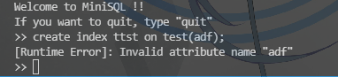

**负责模块CatalogManager**

[toc]

## CatalogManager

CatalogManager模块主要是负责管理数据库的所有模式信息以及对应文件的创建和删除，信息具体如下：

1. 数据库中所有`table`的信息，包括`table`的名称，属性数，该表上的索引，属性包括每个属性的定义信息包括名称，字段类型，unique，primary key，notnull等信息。
2. 数据库中所有index的信息，包括index的名称，所属表的名称以及索引建立所在的字段的信息

并且对顶层的所有调用进行合理性的判断即判断信息与表或者索引的信息是否合理，返回正确信息或者对应的报错信息。与此同时，该模块向上一层提供访问以及修改信息的接口，以便`API`层和`Interpreter`层调用。
为了减少模块之间的耦合，Catalog模块不通过buffer直接对文件进行操作，并且文件按照独立设计的数据字典进行存储，而不是按块进行存储。

### 类的设计

首先是对于信息的存储，由于不打算通过`buffer`层对`catalog`进行管理，所以直接将文件读入内存中保存在对应CatalogManager的对象中。
同时，因为不经过buffer，通过私有的操作将table和index的信息写入文件，并设计好合理的数据字典。
最后就是对上层提供的接口，直接适配上层所需要的所有逻辑，覆盖于table，index的增删查改以及table，index本身的信息的查询。
将这些内容统一写在CatalogManager类中，如下所示。

```c++
class CatalogManager
{
public:
    CatalogManager();
    ~CatalogManager();
    bool CreateTable(Table& table);
    int CreateIndex(Index& index);
    bool DropTable(string& name);
    bool DropIndex(string& name);
    bool CheckAttr(Attribute& attr, struct Unit& data); 
    bool CheckCond(ConditionUnit& cond); 
    bool InsertTest(string& table_name, Tuple& data);
    pair<int, string> SelectTest(string& table_name, vector<string>& Attr,vector<ConditionUnit>& condition);
    Table* GetTableCatalog(string& table_name);	
    Index* GetIndexCatalog(string& index_name);
    vector<Index*> TableToIndex(string& table_name);
    vector<Table*> GetAllTable();
    vector<Index*> GetAllIndex();
    pair<int, string> DeleteTest(string& table_name, vector<ConditionUnit>& condition);	
private:
    vector<Table*> m_table;
    vector<Index*> m_index;
    string table_name = "./database/meta/table.meta";
    string index_name = "./database/meta/index.meta";
    string TypeString[3] = {"INT", "CHAR", "FLOAT"};
    string NameToTF(string& name);
    string NameToIF(string& name);
    void replace();
    int FindTable(string& table_name);
    int FindIndex(string& index_name);
    void readint(int& t, fstream& f);
    void readstring(string&s, fstream& f);
    void readbool(bool&b, fstream& f);
    void readAttr(Attribute& a, fstream& f);
    void readIndex(Index& i, fstream& f);
    Table* readTable(fstream& f);
    void writestring(string&s, fstream& f);
    void writeint(int& i, fstream& f);
    void writebool(bool&b, fstream& f);
    void writeAttr(Attribute& a, fstream& f);
    void writeTable(Table* t, fstream& f);
    void writeIndex(Index* i, fstream& f);
    void writeallTable(fstream& f);
    void writeallIndex(fstream& f);
    void readallTable(fstream& f);
    void readallIndex(fstream& f);
};
```

上述接口中对外的接口都用于和API层、Interpreter层进行交互，对内的用于对catalog相关的文件/内存进行管理

### 数据字典

要存储table和index的meta信息，就需要设计好相应的数据字典以便于文件的读写，针对table和index需要存储的表头信息的不同，分别设计了不同的数据字典用于存储。

+ Table
  ```
  总的表存储设计
  +-----------------------------------------------------+
  | 表数  |    表     |    表    |   ......   |   表     |
  +-----------------------------------------------------+
  单个表的存储设计
  +-----------------------------------------------------+
  | 表名  |  属性数   |   属性   |   ......   |   属性    |
  +-----------------------------------------------------+
  单个属性的存储设计
  +--------------------------------------------------+
  | 属性名 | 类型 | 字符长度 | notnull | unique | 主键 |
  +--------------------------------------------------+

  ```
+ Index
  ```
  总的索引存储设计
  +-----------------------------------------------------+
  | 索引数 |   索引   |   索引   |   ......   |   索引    |
  +-----------------------------------------------------+
  单个索引的存储设计
  +----------------------------------------+
  | 索引名  |   所属表名   |  基于表的属性   |
  +----------------------------------------+
  ```

直接利用上述的数据字典的形式进行文件的存储。

### 文件操作

使用C++的fstream来进行文件的读写操作

为了方便代码的完成，将所有可能的类型的数据的存储和读取都以`private`的函数的形式封装在CatalogManager类中。主要读写的基本元数据包括`int, string, bool`类型的变量，组合的类型包括属性，表，索引等。

由于不经过buffer直接通过内存和文件进行交互，所以，只要内存中的table和index的信息有变化，相应的文件中的信息同样也要有修改，所以还封装了一层全部修改table或者index的函数

#### C++文件处理

通过调用`<fstream>`库使用文件流进行文件的读写

基本上使用的文件操作分为两种，一种是只读，一种是重写，采用二进制存储数据。

```c++
table_file.open(table_name, ios::in|ios::binary);
//上述指令用于只读文件，以二进制存储
table_file.open(table_name, ios::out|ios::binary);
//上述指令用于重新创建文件并且写入，以二进制存储
```

#### 单元操作封装

+ Int/bool类型
  这两个类型操作相差无几，只需将bool和int相互交换即可，下方只列出对int的操作方法
  ```c++
  void CatalogManager::readint(int& t, fstream& f)
  {
      f.read((char*)&t, sizeof(int));
  }

  void CatalogManager::writeint(int& i, fstream& f)
  {
      f.write((char*)&i, sizeof(int));
  }
  ```

+ string类型
  二进制文件的读写需要给出相应的大小，但string无法直接获取stirng的长度，所以设计先存储一个代表长度的int，再存储string的内容
  ```c++
  void CatalogManager::readstring(string&s, fstream& f)
  {
      int n;
      readint(n, f);
      char* a = new char[n];
      f.read(a, n);
      s = a;
      delete[] a;
  }

  void CatalogManager::writestring(string&s, fstream& f)
  {
      int n = s.size() + 1;
      writeint(n, f);
      f.write(s.c_str(), n-1);
      char a = '\0';
      f.write(&a, 1);
  }
  ```

+ Attr、Table、Index类型
  上述类型都可以用之前完成的封装进行二次封装，以下仅展示Table类型的封装
  ```c++
  Table* CatalogManager::readTable(fstream& f)
  {
      TableMetadata m_metadata;	//表的定义信息
	  vector<Attribute> m_attribute;	//表中字段的信息
      Attribute* attr;
      Table* t;
      string tname;
      Index* index = new Index;
      int num;
      readstring(tname, f);
      m_metadata.name = tname;
      readint(num, f);
      m_metadata.attr_num = num;
      for (int j=0; j<num; j++)
      {
          attr = new Attribute;
          readAttr(*attr, f);
          m_attribute.push_back(*attr);
      }
      t = new Table(m_metadata, m_attribute);
      return t;
  }

  void CatalogManager::writeTable(Table* t, fstream& f)
  {
      int num = t->m_metadata.attr_num;
      writestring(t->m_metadata.name, f);
      writeint(num, f);
      for (int i=0; i<num; i++)
          writeAttr(t->m_attribute[i], f);
  }
  ```
  由于Table类型的特殊性，如果使用引用作为参数会导致编译问题，所以在这里选择在函数内部创建变量并且返回该变量的一个指针

+ 全部重写和全部读取
  这一部分在之前内容的实现的基础上就会很简单，只需要按照数据字典的设计，直接调用table和index的读写函数即可，不再展示代码

+ 全部读取后在内存中的架构重构
  由于如下的数据结构
  ```c++
  class Table
  {
  public:
      TableMetadata m_metadata;	   //表的定义信息
      vector<Attribute> m_attribute; //表中字段的信息
      vector<Index*> Index_name;  //对应的index的name
      Table(TableMetadata m_metadata, vector<Attribute> m_attribute);
      Table(Table &table);
      Table();
      void Print();
  };

  class Index
  {
  public:
      string index_name;
      Table* table;
      string table_name;
      int attr_num;	
      Index();
      Index(string index_name, Table* table, string table_name, int attr_num);
      void Print() const;
  };
  ```
  需要在将存储信息读取出来之后重新构建对应本次读取的内存中的指针。故每次重新读取之后都需要进行一次构建，封装如下
  ```c++
  void CatalogManager::replace()
  {
      int it = m_index.size();
      for (int i=0; i<it; i++)
      {
          int j = FindTable(m_index[i]->table_name);
          m_table[j]->Index_name.push_back(m_index[i]);
          m_index[i]->table = m_table[j];
      }
  }
  ```

至此，可以通过所有的封装接口对Catalog的文件进行操作。

### 接口实现

CatalogManager需要对API层和Interpreter层提供可使用的接口，接口需要包含对catalog所有存储数据的增删查改。
由于代码复杂，下面仅写出接口并且解释设计原理，代码详见[CatalogManager.cpp](../../../CatalogManager.cpp)。

#### Create

创建时的级联创建由上一层处理

+ Table
  ```c++
  //创建包含表，需要检查重复性，返回值true表示成功，false表示失败
  bool CatalogManager::CreateTable(Table& table);
  ```
  对于一个新的Table的创建，通过传递来的数据和自身的数据，通过表名判断是否名称重复，如果重复则创建不成功，返回一个false。如果名称不重复，则把该table类加入到所有的table中，按照数据字典规定的方式重写table文件
+ Index
  ```c++
  //创建索引，需要检查重复性，返回值1表示成功，0表示名称重复， -1表示对应的表不存在
  int CatalogManager::CreateIndex(Index& index)
  ```
  这里因为Index的正确性判断复杂，返回值不能单纯用bool类型来表达，所以改换为int。仍然是判断表名的重复性，同时还包括判断对应的表的存在性。因为对于属性名正确的判断一开始写在了外部，所以这里并没有判断对于相应属性的存在性。其他和Table基本相同。
  
  图片说明了此处未作的判断在外部有做处理
#### Drop

由上层处理级联的删除调用下面两个函数，删除顺序应当是先删除Table中的所有Index再删除Table。删除做的操作流程就是先在表头信息文件中删掉对应的信息，然后直接remove掉对应的表的文件的内容。

+ Table
  ```c++
  //删除表，通过name判断删除哪张表，需要检查存在性，返回值true表示成功，false表示失败
  bool DropTable(string& name);
  ```
  如果Table中本来含有Index的话，实际上会在上一层首先调用Index的Drop函数先删除掉所有的Index再进行Table的删除

+ Index
  ```c++
  //删除索引，通过name判断删除哪个索引，需要检查存在性，返回值true表示成功，false表示失败
  bool DropIndex(string& name);
  ```
  删除Index的时候，需要注意的一点就是要修改Table中的对于Index的name的存储，删掉对应的信息。也就是说这里需要重写Index和Table两个文件

#### Select

搜索记录在catalog层做对于表的存在性以及条件的正确性的一个验证，对于不同的错误返回不同的信息用于打印错误信息。
```c++
/**
 * <-4,"attr名,attr类型,应该的类型"> attr出错（逗号一并返回便于split
 * <-3,表格名> （表格不存在）
 * <-2,错误类型名> （选择条件类型不匹配）
 * <-1,"attr名"> condition的attr不存在
 * <0, 表名> record查询
 * <1, index名> index 查询
 */
pair<int, string> CatalogManager::SelectTest(string& table_name, \
        vector<string>& Attr, vector<ConditionUnit>& condition)
```
在select中基本上就是对于上述返回的可能的问题做一个判断，以验证语句的正确性。由于Index的可能存在，需要检查要select的类型是否有作为index的类型的，如果有，就可以直接通过index来查找以提高速度。

#### Insert

插入记录主要是验证表的存在性，并且对于给定的Tuple验证每一个DataUnit的值是否可以和Table中属性的类型对应
```c++
//判断是否可以插入：检查每个DataUnit中的数据类型是否与表定义的数据类型匹配
bool InsertTest(string& table_name, Tuple& data);	
```
这里默认在输出的时候，从前到后的顺序就是Table中的属性从前到后的顺序，所以直接前到后进行遍历，如果属性不相同的话，就返回错误信息，因为这里的错误也只能是数据类型的不匹配，所以使用bool类型基本是可以的。

对于Int和Float类型，int可以转化为float，所以在插入的时候输入int要求float的信息会在内部默认性的转换为一个float

在函数内部需要判断对应的Attribute的正确性，通过调用封装的函数如下
```c++
bool CatalogManager::CheckAttr(Attribute& attr, struct Unit& data)
{
    if (data.datatype == DataType::INT_UNIT && attr.type == DataType::FLOAT_UNIT)
    {
        data.datatype = DataType::FLOAT_UNIT;
        float va = (float)data.value.int_value;
        data.value.float_value = va;
    }
    return attr.type == data.datatype;
}
```
就是在这里实现所有的隐式的类型转换。包括后续如果增加了更多的隐式类型转换可以直接在这里进行修改，增强了可扩展性。并且这一个函数作为public的函数也可以供给上层进行一个简单的类型判断。

#### Delete

删除记录实际上也就是检测对应的condition的属性的正确性。
```c++
//返回值：-2（表格不存在） -1（删除条件出错）；0（只能通过遍历Record删除）；1（可以利用索引优化删除）
pair<int, string> CatalogManager::DeleteTest(string& table_name, \
             vector<ConditionUnit>& condition)
```
基本上是类似于select的一个检测，不过相较于insert少了一个Attribute的判断。
还是只是单纯的检测所有的条件，不在这里过多赘述

#### 信息获取

总共是提供了五个获取catalog内部存储的信息的接口，如下
```c++
//获取表名为table_name的Catalog信息，如果不存在则返回空的Table
Table* GetTableCatalog(string& table_name);	
Index* GetIndexCatalog(string& index_name);
//返回table_name表中的Index指针集合，如果不存在则返回空的Index
vector<Index*> TableToIndex(string& table_name);
//获取所有的Table指针
vector<Table*> GetAllTable();
//获取所有的Index指针
vector<Index*> GetAllIndex();
```
这些接口的实现只是依靠单纯的变量返回或者简单的查找，可以把这些接口扩展为各种show类型的语句等或者是对其他模块提供信息。